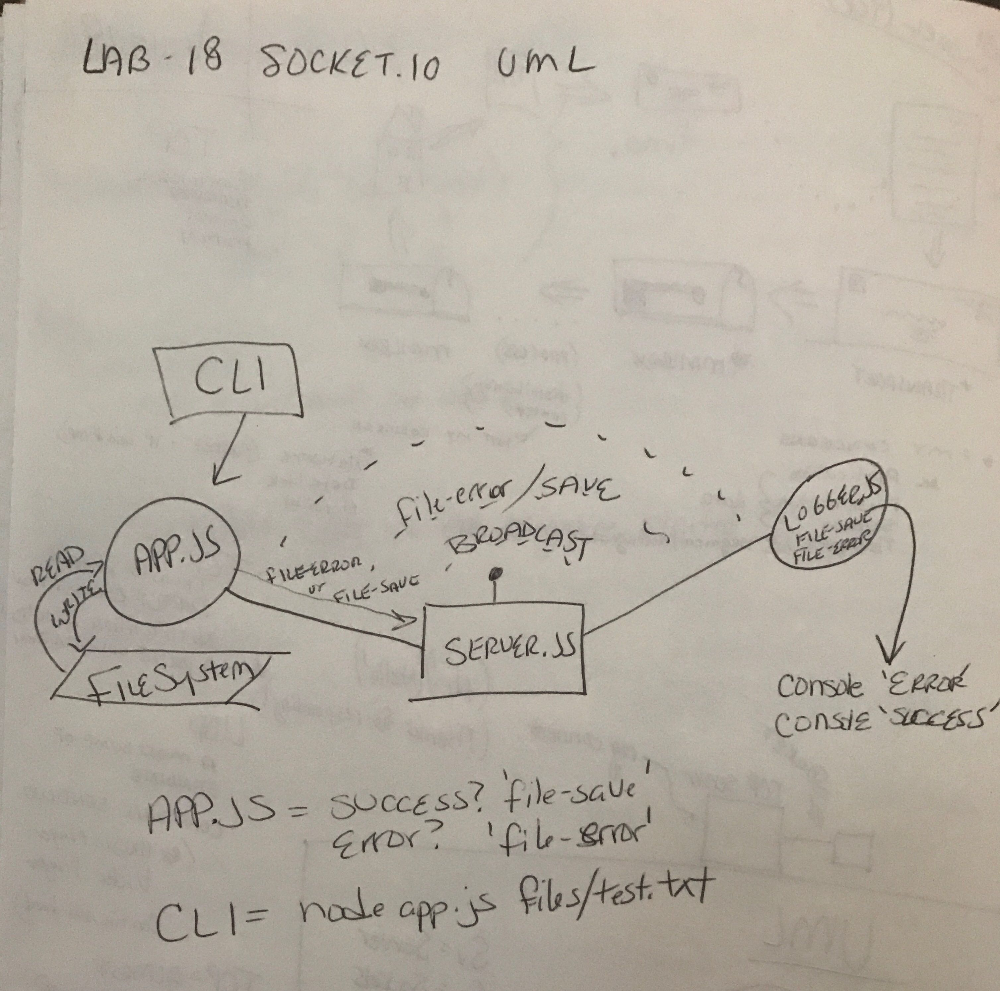

# lab-18
Socket.io

##Author: Chloie Parsons 

## Links and Resources
* submission PR: https://github.com/chloieparsons-401-advanced-javascript/lab-18/pull/1
* Travis: https://www.travis-ci.com/chloieparsons-401-advanced-javascript/lab-18

## Modules
* app.js
* logger.js
* server.js

## Setup
### .env requirements
PORT - 3000

## Running the app
* npm start script (node app.js)

## Tests
* npm run test
* npm run test-watch
* npm run lint

##UML
